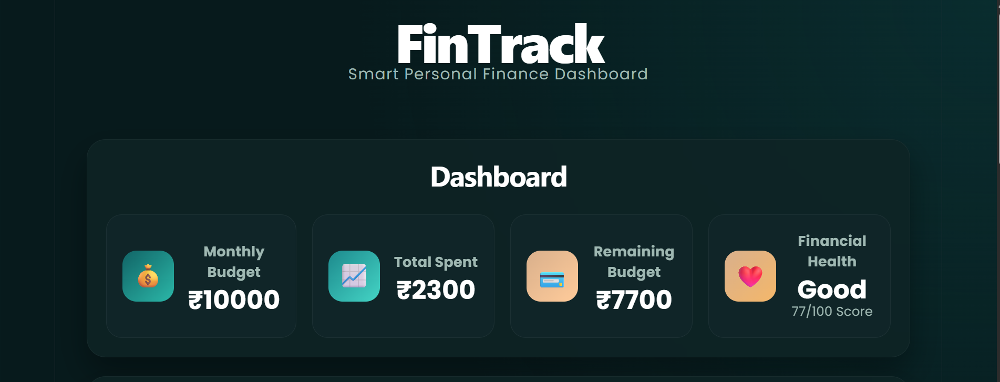

# FinTrack 💰

A modern Personal Finance Analytics Dashboard built using React and Vite.

## Live Demo

https://personal-finance-analytics-dashboar.vercel.app/

## Features

- Add and manage expenses
- Categorize spending
- Interactive analytics dashboard
- Spending insights
- Financial health tracking
- Local storage persistence
- Responsive design
- Modern fintech-inspired UI

## Tech Stack

- React
- Vite
- JavaScript
- CSS
- Recharts
- Local Storage
- Vercel

## Screenshots

### Dashboard

### Expenses

### Analytics

## Future Improvements

- Monthly spending forecasts
- Export to CSV
- User authentication
- Cloud synchronization

## Author

Shafiya